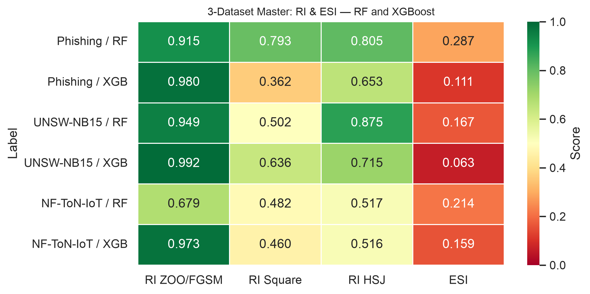
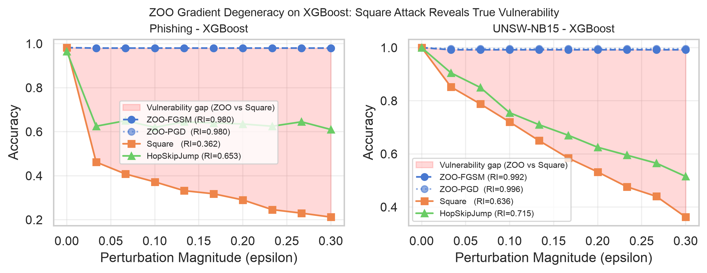
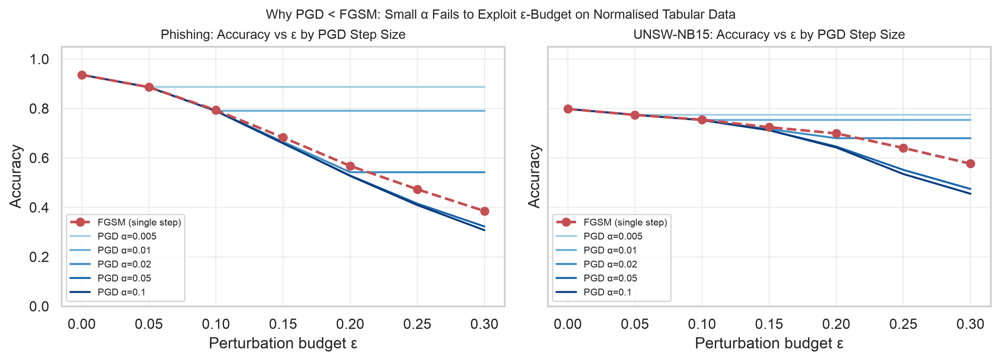

# Adversarial Robustness and Explainability Drift in Cybersecurity Classifiers

[](https://doi.org/10.5281/zenodo.20968236)

Experimental code for the paper series:

| Version | Venue | Citation |
|---------|-------|----------|
| Conference | ICAART 2026 | Rajhans & Khawarey (2026), pp. 3101–3108, SciTePress. DOI: [10.5220/0014360100004052](https://doi.org/10.5220/0014360100004052) |
| Extended | LNAI (in preparation) | — |

**Authors:** Mona Rajhans (Palo Alto Networks) · Vishal Khawarey (Quicken Inc.)

---

## Cite This Work

```bibtex
@conference{khawarey2026empirical,
  author    = {Mona Rajhans and Vishal Khawarey},
  title     = {Empirical Analysis of Adversarial Robustness and Explainability
               Drift in Cybersecurity Classifiers},
  booktitle = {Proceedings of the 18th International Conference on Agents and
               Artificial Intelligence - Volume 4: ICAART},
  year      = {2026},
  pages     = {3101--3108},
  publisher = {SciTePress},
  doi       = {10.5220/0014360100004052},
  isbn      = {978-989-758-796-2},
}
```

---

## Overview

We study how adversarial attacks degrade both **prediction accuracy** and
**SHAP-based explanations** in tabular cybersecurity classifiers, and introduce
two metrics:

- **Robustness Index (RI)** — area under the accuracy–perturbation curve
  (higher = more robust):
  ```
  RI = (1/ε_max) ∫₀^{ε_max} Acc(ε) dε
  ```

- **Explainability Stability Index (ESI)** — area under the normalised SHAP-drift
  curve, inverted (higher = more stable explanations under attack):
  ```
  ESI = 1 − (1/ε_max) ∫₀^{ε_max} D̄(ε) dε
  ```

**Key finding:** XGBoost shows near-perfect prediction robustness under ZOO
(RI ≈ 0.98) but very low explanation stability (ESI ≈ 0.06–0.11).
Prediction robustness and explanation stability are decoupled.



---

## Notebooks

| Notebook | Description |
|----------|-------------|
| `robustness_study.ipynb` | Base study — MLP on Phishing & UNSW-NB15. FGSM/PGD attacks, SHAP drift, adversarial training (ICAART 2026). |
| `robustness_study_extension.ipynb` | LNCS extension — RF & XGBoost, ZOO black-box attack, TreeSHAP drift, ESI metric. |
| `robustness_tree_attacks_comparison.ipynb` | Square Attack & HopSkipJump vs ZOO on tree models. ZOO degeneracy analysis. |
| `robustness_toniot.ipynb` | Third dataset (NF-ToN-IoT) — RF & XGBoost with all three black-box attacks + ESI. |
| `robustness_pgd_ablation.ipynb` | PGD step-size ablation — explains why PGD < FGSM on z-score normalised tabular data. |

---

## Key Results

### Attack-Method Sensitivity: ZOO vs Square Attack

XGBoost appears robust under ZOO (RI = 0.98) but is highly vulnerable under
Square Attack (RI = 0.36 on Phishing). The gap exposes a methodological risk:
**attack-method selection is not model-agnostic**.



### PGD Step-Size Ablation

PGD with the conventional step size (α = 0.01) is systematically weaker than
FGSM on z-score normalised tabular data. The gap closes only at α ≥ 0.05,
confirming the effect is a hyperparameter sensitivity artifact.



### Full Results Table

| Dataset | Model | Clean Acc | RI ZOO/FGSM | RI Square | RI HSJ | ESI |
|---------|-------|-----------|-------------|-----------|--------|-----|
| Phishing | MLP | 0.857 | 0.610 | — | — | — |
| Phishing | RF | 0.977 | 0.915 | 0.793 | 0.805 | 0.287 |
| Phishing | XGB | 0.981 | 0.980 | 0.362 | 0.653 | 0.111 |
| UNSW-NB15 | MLP | 0.774 | 0.692 | — | — | — |
| UNSW-NB15 | RF | 0.998 | 0.949 | 0.502 | 0.875 | 0.167 |
| UNSW-NB15 | XGB | 0.999 | 0.992 | 0.636 | 0.715 | 0.063 |
| NF-ToN-IoT | RF | 0.998 | 0.679 | 0.482 | 0.517 | 0.214 |
| NF-ToN-IoT | XGB | 0.998 | 0.973 | 0.460 | 0.516 | 0.159 |

MLP: white-box (FGSM/PGD). RF/XGB: black-box (ZOO, Square Attack, HopSkipJump).
ESI via TreeSHAP for tree models.

---

## Datasets

Large files are excluded from git. Download before running:

| File | Source | Command |
|------|--------|---------|
| `Phishing_Legitimate_full.csv` | [Kaggle — shashwatwork](https://www.kaggle.com/datasets/shashwatwork/phishing-dataset-for-machine-learning) | `kaggle datasets download shashwatwork/phishing-dataset-for-machine-learning -p . --unzip` |
| `UNSW_NB15_training-set.csv` | [Kaggle — mrwellsdavid](https://www.kaggle.com/datasets/mrwellsdavid/unsw-nb15) | `kaggle datasets download mrwellsdavid/unsw-nb15 -p . --unzip` |
| `NF-ToN-IoT.parquet` | [Kaggle — dhoogla](https://www.kaggle.com/datasets/dhoogla/nftoniot) | `kaggle datasets download dhoogla/nftoniot -p . --unzip` |

Requires a `~/.kaggle/kaggle.json` API token.

---

## Setup

```bash
python3 -m venv .venv
source .venv/bin/activate
pip install -r requirements.txt
pip install xgboost pyarrow
jupyter notebook
```

Run notebooks in order: `robustness_study` → `robustness_study_extension` →
`robustness_tree_attacks_comparison` → `robustness_toniot` → `robustness_pgd_ablation`.

---

## Repository Structure

```
robustness_drift_classifiers/
  *.ipynb                          — experiment notebooks
  figures/                         — generated figures
  master_robustness_table.csv      — full 3-dataset results
  pgd_ablation_table.csv           — PGD step-size ablation results
  requirements.txt
  SCITEPRESS_robustness_cybersec/  — LaTeX source (ICAART 2026)
  .gitignore                       — excludes datasets and .venv
```

---

## License

Code: MIT. Paper text and figures: © SciTePress / Springer (respective publishers).
